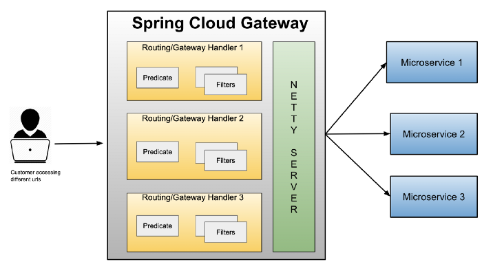

# Spring Cloud Gateway (SCG)

### API Gateway
인증/모니터링/오케스트레이션 등과 같은 기능이 추가된 Reverse Proxy를 의미 한다. Netflix zuul, Amazon API Gateway, Apigee 및 Spring Cloud Gateway 같은 것들이 잘 알려진 Api Gateway 구현체들이다.

### Spring Cloud Gateway
Spring reactive ecosystem을 기반으로 Spring Cloud 팀이 구현한 API 게이트웨이이다. 또한 논블로킹(non-blocking), 비동기(Asynchronous) 방식의 Netty Server를 내부적으로 사용한다

요청에 대해 라우팅이 작동하는 대략적인 방식은 다음과 같다

Spring Cloud Gateway는 다음 세 가지 주요 구성 요소로 이루어져 있다

**Route:** 게이트웨이의 기본 골격이다. ID, 목적지 URI, 조건부(predicate) 집합, 필터(filter) 집합으로 구성된다. 조건부가 맞게 되면 해당하는 경로로 이동하게 된다.

**Predicate:** Java8의 Function Predicate이다. Input Type은 Spring Framework ServerWebExchange이다. 조건부를 통해 Header 나 Parameter같은 HTTP 요청의 모든 항목을 비교할 수 있다.

**Filter(필터):** 특정 팩토리로 구성된 Spring Framework GatewayFilter 인스턴스다. Filter에서는 다운스트림 요청 전후에 요청/응답을 수정할 수 있다.

### Run

### Reference
 - [https://docs.spring.io/spring-cloud-gateway/docs/current/reference/html/#glossary](https://docs.spring.io/spring-cloud-gateway/docs/current/reference/html/#glossary)
- [https://medium.com/@niral22/spring-cloud-gateway-tutorial-5311ddd59816](https://medium.com/@niral22/spring-cloud-gateway-tutorial-5311ddd59816)